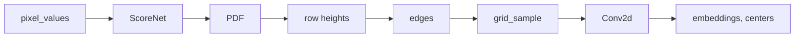
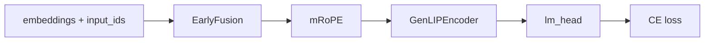

# DartLIP

**DartLIP** — визуальный энкодер на базе **DART** (Dynamic Adaptive Resampling Tokenizer). Он вырезает патчи с content-aware деформацией сетки и отдаёт vision-токены с пространственными центроидами.

В этом репозитории энкодер обучается через captioning: **GenLIP** выступает обучающим каркасом — склеивает vision-токены с текстом и даёт сигнал next-token loss. После обучения DartLIP интегрируется во внешнюю VLM вместо стандартного patch embedding.

---

## Содержание

- [Архитектура](#архитектура)
- [Два этапа обучения](#два-этапа-обучения)
- [DART — визуальный энкодер](#dart--визуальный-энкодер)
- [GenLIP — обучающий каркас](#genlip--обучающий-каркас)
- [Обучение](#обучение)
- [Запуск](#запуск)
- [Структура репозитория](#структура-репозитория)

---

## Архитектура

Схемы повторяют `DART.forward` и `GenLIP.forward`.

**DartLIP** — [`vision/tokenizer/dart.py`](vision/tokenizer/dart.py)



`ScoreNet` — MobileNetV3 (`features[:17]`) и MLP. `row heights` и `edges` строятся из PDF, `grid_sample` вырезает патчи 16×16, `Conv2d` даёт `(B, N, 1152)` и центроиды `(B, N, 2)`.

**Обучение** — [`vision/genlip/model.py`](vision/genlip/model.py)



После обучения веса `ScoreNet` и `Conv2d` забираются во внешнюю VLM.

| Компонент | Роль |
|---|---|
| **DartLIP (DART)** | Визуальный энкодер — продукт репозитория |
| **GenLIP** | Обучающий каркас: fusion, transformer, LM head для captioning |
| **mRoPE** | 3D-позиции `(t, h, w)`: для патчей — центроиды, для текста — 1D со сдвигом |
| **Prefix-LM** | Маска внимания на время обучения: патчи ↔ патчи, текст → патчи + causal text |

Размерность vision-токенов: `1152`. GenLIP-энкодер: 16 голов, `head_dim = 72`, 27 слоёв.

---

## Два этапа обучения

| | Stage 1 | Stage 2 |
|---|---|---|
| Конфиг | [`vision/config_stage1.yaml`](vision/config_stage1.yaml) | [`vision/config_stage2.yaml`](vision/config_stage2.yaml) |
| Изображение | квадрат 224×224 | native aspect ratio |
| Патчи | ровно 196 (сетка 14×14) | от 16 до 1024 |
| Текст | до 128 токенов | до 512 токенов |
| Батч | обычный collate | patch-n-pack, `batch_size = 1` |
| Длина последовательности | до 4096 | до 16384 |
| Learning rate | `1e-5` | `1e-4` |

Stage 1 — warm-up на фиксированном разрешении. Stage 2 — variable resolution и упаковка нескольких пар «картинка + подпись» в одну последовательность (patch-n-pack). Attention между разными примерами в паке запрещён.

---

## DART — визуальный энкодер

Реализация: [`vision/tokenizer/dart.py`](vision/tokenizer/dart.py)

```
изображение (B, 3, H, W)
        │
        ▼
MobileNetV3-Large, слои 0–16  →  признаки
        │
        ▼
MLP 960 → 96 → 1  →  скоры на сетке патчей
        │
        ▼
нормализация, sigmoid + 0.1  →  PDF
        │
        ├─ высоты строк из квантилей PDF
        ├─ пересчёт PDF по новым строкам
        └─ горизонтальные границы патчей
        │
        ▼
grid_sample  →  (B, N, 3, 16, 16)
        │
        ▼
Conv2d 3 → 1152  →  vision-токены + центроиды (y, x)
```

Скоры считаются на опорном размере (224×224 на stage 2, сам вход на stage 1), затем интерполируются на сетку `H/16 × W/16`. Число патчей на stage 1 фиксировано. На stage 2 оно следует за размером картинки после `resize_for_patch_budget`.

Backbone MobileNet во время обучения держится в `eval`: dropout выключен, BatchNorm использует накопленную статистику. Веса при этом остаются в оптимизаторе вместе с остальной моделью.

**Выход энкодера:** `(B, N, 1152)` vision-токены и `(B, N, 2)` центроиды патчей для mRoPE.

---

## GenLIP — обучающий каркас

Реализация: [`vision/genlip/model.py`](vision/genlip/model.py)

GenLIP не является целевой моделью. Он нужен, чтобы дать энкодеру сигнал через captioning:

1. DART возвращает vision-токены и центроиды.
2. Текст эмбеддится и конкатенируется после vision-префикса (early fusion).
3. Общий transformer с prefix-LM маской и interleaved mRoPE обрабатывает последовательность.
4. LM head предсказывает следующий токен подписи → cross-entropy loss.

Градиенты текут через DART end-to-end. После обучения веса DART (`score_prediction_network` + `projection`) забираются во внешнюю VLM.

### Prefix-LM (на время обучения)

```
         key →
       [vision | text]
query  vision   full     —
       text     full     causal
```

### Interleaved mRoPE

Реализация: [`vision/genlip/interleaved_mrope.py`](vision/genlip/interleaved_mrope.py)

- vision — `(t = 0, h = y_center / 16, w = x_center / 16)` по центроидам DART;
- text — 1D-позиция на всех трёх осях, со сдвигом `max(grid_h, grid_w)`.

```yaml
mrope_sections: [12, 12, 12]   # 36 полос на head_dim = 72
mrope_theta: 10000.0
```

---

## Обучение

Точка входа — [`vision/train/train.py`](vision/train/train.py). Скрипт всегда поднимает NCCL, поэтому запуск только через `torchrun`.

`parallel.replicate × parallel.shard` должно совпадать с числом процессов. Слои энкодера и модель целиком оборачиваются в FSDP2 (`fully_shard`). При `parallel.bf16: true` параметры хранятся в bf16 на Ampere и новее, иначе в fp16; редукция градиентов — в fp32.

Оптимизатор по умолчанию — AdamW, расписание — cosine с warmup. Каждые `log_every` шагов rank 0 дописывает `runs/loss.csv` и, если установлен matplotlib, обновляет `runs/loss.png`.

Датасет по умолчанию — [`gorovuha/ru_image_captioning`](https://huggingface.co/datasets/gorovuha/ru_image_captioning), колонка подписи `capt2`. Картинки нормализуются статистикой ImageNet. Кэш датасета лежит в `data/`, логи — в `runs/`; оба каталога в `.gitignore`.

---

## Запуск

```bash
pip install "torch>=2.5" torchvision transformers datasets timm pyyaml pillow numpy tqdm matplotlib
```

`matplotlib` нужен только для графика loss.

Stage 1, одна GPU:

```bash
torchrun --nproc_per_node=1 -m vision.train.train --config vision/config_stage1.yaml
```

Stage 2:

```bash
torchrun --nproc_per_node=1 -m vision.train.train --config vision/config_stage2.yaml
```

Несколько GPU: `--nproc_per_node` и произведение `parallel.replicate` × `parallel.shard` должны совпадать. Команду запускать из корня репозитория.

---

## Структура репозитория

```
DartLIP/
├── vision/
│   ├── config_stage1.yaml          # 224², 196 патчей
│   ├── config_stage2.yaml          # AnyRes + patch-n-pack
│   ├── genlip/
│   │   ├── config.py               # dataclasses и load_config
│   │   ├── model.py                # GenLIP — обучающий каркас
│   │   └── interleaved_mrope.py    # частоты mRoPE и rotary на Q/K
│   ├── tokenizer/
│   │   └── dart.py                 # DART — визуальный энкодер
│   └── train/
│       ├── train.py                # entry point
│       ├── data.py                 # датасет и packing
│       ├── image_utils.py          # бюджет патчей при native aspect ratio
│       ├── trainer.py              # цикл, клип градиента, логи
│       ├── optim.py                # AdamW и cosine
│       └── parallel.py             # NCCL и FSDP2
├── data/                           # кэш Hugging Face, не в git
└── runs/                           # loss.csv и loss.png, не в git
```
