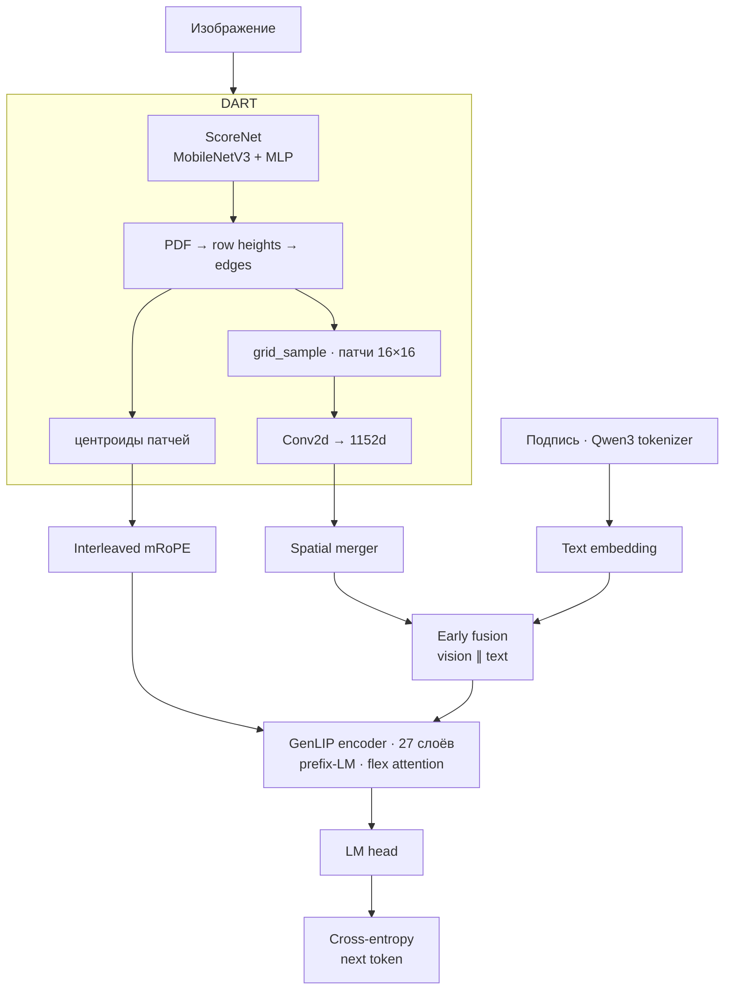

# FlowVLM

Vision-language модель для генерации подписей к изображениям. **DART** вырезает патчи с content-aware деформацией сетки, **GenLIP** склеивает их с текстом и учится предсказывать следующий токен подписи.

Обучение идёт в два этапа: сначала фиксированное разрешение, затем native aspect ratio и упаковка нескольких пар «картинка + подпись» в одну последовательность.

---

## Содержание

- [Архитектура](#архитектура)
- [Два этапа обучения](#два-этапа-обучения)
- [DART](#dart)
- [GenLIP](#genlip)
- [Обучение](#обучение)
- [Запуск](#запуск)
- [Структура репозитория](#структура-репозитория)

---

## Архитектура



| Компонент | Что делает |
|---|---|
| **DART** | Оценивает важность областей и перераспределяет патчи по изображению |
| **GenLIP** | Общий transformer для vision- и text-токенов, LM head только на тексте |
| **mRoPE** | 3D-позиции `(t, h, w)`: для патчей — реальные центроиды, для текста — 1D со сдвигом |
| **Prefix-LM** | Патчи видят друг друга полностью, текст смотрит на патчи и на предыдущие токены |

Размерность по умолчанию: `hidden_size = 1152`, 16 голов, `head_dim = 72`, 27 слоёв, словарь Qwen3 (`151936`).

---

## Два этапа обучения

| | Stage 1 | Stage 2 |
|---|---|---|
| Конфиг | [`vision/config_stage1.yaml`](vision/config_stage1.yaml) | [`vision/config_stage2.yaml`](vision/config_stage2.yaml) |
| Изображение | квадрат 224×224 | исходное соотношение сторон |
| Патчи | ровно 196 (сетка 14×14) | от 16 до 1024 |
| Текст | до 128 токенов | до 512 токенов |
| Батч | обычный collate | patch-n-pack, `batch_size = 1` |
| Длина последовательности | до 4096 | до 16384 |
| Learning rate | `1e-5` | `1e-4` |

На втором этапе несколько примеров склеиваются в одну последовательность, пока суммарная длина (патчи + текст) не превысит `max_packing_length`. Attention между разными примерами в паке запрещён.

---

## DART

Реализация: [`vision/tokenizer/dart.py`](vision/tokenizer/dart.py)

```
изображение (B, 3, H, W)
        │
        ▼
MobileNetV3-Large, слои 0–16  →  признаки
        │
        ▼
MLP 960 → 96 → 1  →  скоры на сетке патчей
        │
        ▼
нормализация, sigmoid + 0.1  →  PDF
        │
        ├─ высоты строк из квантилей PDF
        ├─ пересчёт PDF по новым строкам
        └─ горизонтальные границы патчей
        │
        ▼
grid_sample  →  (B, N, 3, 16, 16)
        │
        ▼
Conv2d 3 → 1152  →  токены и центроиды (y, x)
```

Скоры считаются на опорном размере (224×224 на stage 2, сам вход на stage 1), затем интерполируются на сетку `H/16 × W/16`. Число патчей на stage 1 фиксировано. На stage 2 оно следует за размером картинки после `resize_for_patch_budget`.

Backbone MobileNet во время обучения держится в `eval`: dropout выключен, BatchNorm использует накопленную статистику. Веса при этом остаются в оптимизаторе вместе с остальной моделью.

---

## GenLIP

Реализация: [`vision/genlip/model.py`](vision/genlip/model.py)

### Forward

1. DART возвращает vision-токены и центроиды патчей.
2. `SpatialMerger` сжимает соседние патчи, если `spatial_merge_size > 1`. В конфигах он равен 1, слой пропускает токены как есть.
3. Текст эмбеддится и конкатенируется после vision-префикса.
4. Позиции mRoPE и prefix-LM маска строятся по длине префикса.
5. Энкодер, финальный LayerNorm, LM head только на текстовых позициях.
6. Loss — next-token cross-entropy. Паддинг в метках равен `-100` и не входит в loss.

### Prefix-LM

```
         key →
       [vision | text]
query  vision   full     —
       text     full     causal
```

Патчи видят только другие патчи. Текст видит все патчи своего примера и предыдущие текстовые токены.

Маска собирается через `create_block_mask`. Последовательность паддится до кратности блока flex attention: 128 на GPU с compute capability ≥ 8, иначе 32. В packed-режиме то же правило действует внутри каждого сегмента, чужие сегменты невидимы.

### Interleaved mRoPE

Реализация: [`vision/genlip/interleaved_mrope.py`](vision/genlip/interleaved_mrope.py)

Частоты чередуются по осям `(t, h, w)`:

- vision — `(t = 0, h = y_center / 16, w = x_center / 16)` по центроидам DART;
- text — одна и та же 1D-позиция на всех трёх осях, со сдвигом `max(grid_h, grid_w)`.

```yaml
mrope_sections: [12, 12, 12]   # 36 полос на head_dim = 72
mrope_theta: 10000.0
```

Q и K вращаются этими частотами. У query-проекции удвоенная ширина: вторая половина — sigmoid-гейт на выходе attention.

### Слой энкодера

Pre-norm, gated attention, SwiGLU (`3072`), layer scale (`0.1`) и DropPath (`0.1`). На энкодере включён gradient checkpointing.

---

## Обучение

Точка входа — [`vision/train/train.py`](vision/train/train.py). Скрипт всегда поднимает NCCL, поэтому запуск только через `torchrun`.

`parallel.replicate × parallel.shard` должно совпадать с числом процессов. Слои энкодера и модель целиком оборачиваются в FSDP2 (`fully_shard`). При `parallel.bf16: true` параметры хранятся в bf16 на Ampere и новее, иначе в fp16; редукция градиентов — в fp32.

Оптимизатор по умолчанию — AdamW, расписание — cosine с warmup. Каждые `log_every` шагов rank 0 дописывает `runs/loss.csv` и, если установлен matplotlib, обновляет `runs/loss.png`.

Датасет по умолчанию — [`gorovuha/ru_image_captioning`](https://huggingface.co/datasets/gorovuha/ru_image_captioning), колонка подписи `capt2`. Картинки нормализуются статистикой ImageNet. Кэш датасета лежит в `data/`, логи — в `runs/`; оба каталога в `.gitignore`.

---

## Запуск

```bash
pip install "torch>=2.5" torchvision transformers datasets timm pyyaml pillow numpy tqdm matplotlib
```

`matplotlib` нужен только для графика loss.

Stage 1, одна GPU:

```bash
torchrun --nproc_per_node=1 -m vision.train.train --config vision/config_stage1.yaml
```

Stage 2:

```bash
torchrun --nproc_per_node=1 -m vision.train.train --config vision/config_stage2.yaml
```

Несколько GPU: `--nproc_per_node` и произведение `parallel.replicate` × `parallel.shard` должны совпадать. Команду запускать из корня репозитория.

---

## Структура репозитория

```
FlowVLM/
├── vision/
│   ├── config_stage1.yaml          # 224², 196 патчей
│   ├── config_stage2.yaml          # AnyRes + patch-n-pack
│   ├── genlip/
│   │   ├── config.py               # dataclasses и load_config
│   │   ├── model.py                # GenLIP, fusion, prefix-LM, LM head
│   │   └── interleaved_mrope.py    # частоты mRoPE и rotary на Q/K
│   ├── tokenizer/
│   │   └── dart.py                 # ScoreNet, warp, выборка патчей
│   └── train/
│       ├── train.py                # entry point
│       ├── data.py                 # датасет и packing
│       ├── image_utils.py          # бюджет патчей при native aspect ratio
│       ├── trainer.py              # цикл, клип градиента, логи
│       ├── optim.py                # AdamW и cosine
│       └── parallel.py             # NCCL и FSDP2
├── data/                           # кэш Hugging Face, не в git
└── runs/                           # loss.csv и loss.png, не в git
```
